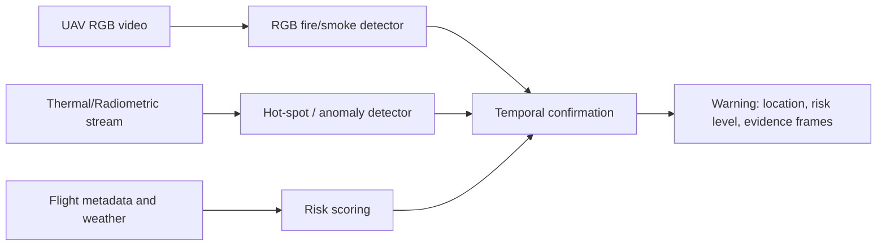

# Stage4 数据集与方法调研报告

生成日期：2026-06-08

## 1. 先回答最核心的问题

当前本机有 GPU 硬件，但网页检测速度取决于运行 FastAPI 的 Python 环境。现在 `D:\Python\python.exe` 里的 PyTorch 是 CPU 版，所以即使电脑有 RTX 3070，网页上传图片或视频时仍然是 CPU 推理。视频解析、逐帧写回 MP4、切片检测都会被本机环境显著影响。要测真实部署速度，必须使用 CUDA 版 PyTorch、ONNX Runtime GPU 或 TensorRT。

第三轮模型没有达到预期，不是因为“P2 这个方向完全错”，而是因为 P2 和 `imgsz=960` 没有配套到真正的高分辨率、小火/小烟训练样本。当前数据大多已经是 `640x640`，把 640 图像放大到 960 只会插值，不会恢复远处小火点的纹理。数据审计还显示，valid/test 中 tiny fire/smoke 和 small smoke 极少，模型几乎没有足够监督去学习“无人机远景小火苗、微弱烟雾、多火点”。

因此下一轮不能先做大模型长训，而要先做数据路线验证：建立固定 UAV hard set，补高分辨率 tile 训练样本，再用 10-20 epoch scout run 判断 small fire/smoke recall 是否真的提升。

## 2. 第三轮失败的主要原因

本轮结果：

| 模型 | Precision | Recall | mAP50 | mAP50-95 |
|---|---:|---:|---:|---:|
| 第一轮 YOLOv8m Sensors 3类 100轮 | 0.83597 | 0.78047 | 0.84562 | 0.57364 |
| 第三轮 YOLOv8m-P2 Sensors 3类 120轮 | 0.84056 | 0.76795 | 0.83870 | 0.57468 |

结论很清楚：新模型更保守，Precision 略升，但 Recall、mAP50 和小目标测试都没有提升。P2 增加了计算量，却没有获得足够小目标监督。

关键数据问题：

| split | tiny fire | tiny smoke | small fire | small smoke |
|---|---:|---:|---:|---:|
| valid | 20 | 2 | 1982 | 38 |
| test | 11 | 0 | 840 | 17 |

这意味着 current Sensors 数据能支撑“明火/明显烟雾检测”，但不能支撑论文目标里的“无人机远景小目标早期预警”。如果继续只在这个数据集上改结构，收益大概率很低。

## 3. 外部数据集能否直接用

### VisDrone2019-DET

VisDrone 是无人机视角小目标检测的经典数据集。官方说明它包含 288 个视频、261,908 帧和 10,209 张静态图，场景覆盖多城市、不同天气和光照，并提供超过 260 万个目标框，目标包括行人、车辆、自行车等。它非常适合研究无人机视角、小目标、密集遮挡和尺度变化，但类别不是 fire/smoke。

判断：不能直接作为火/烟最终训练集。可以用于中间预训练或结构验证，让模型先学习 UAV 视角下的小目标定位，再替换检测头并微调到 fire/smoke。但它不是下一轮最优先事项，因为我们的最大短板是目标域 fire/smoke 小样本不足。

来源：https://github.com/VisDrone/VisDrone-Dataset

### TinyPerson

TinyPerson 的核心价值是说明“预训练数据和目标检测数据之间的尺度不匹配会损害 tiny-object 表征”。论文提出 Scale Match，是非常适合我们写论文时解释“为什么 COCO/普通火灾图像预训练不够”的依据。

判断：不建议直接用于下一轮长训。它只有 tiny person，类别和火烟差异太大。可作为方法启发或可选预训练，不应优先于补火/烟 UAV 数据。

来源：https://arxiv.org/abs/1912.10664

### HIT-UAV

HIT-UAV 是高空无人机红外热成像目标检测数据集，包含 2,898 张红外热图，从 43,470 帧中抽取，类别为 Person、Bicycle、Car、OtherVehicle，并提供标准框和旋转框。它对“红外小目标、热成像噪声、高空视角”有价值。

判断：不能直接训练 fire/smoke 检测头。后续如果做热成像风险分支，HIT-UAV 可以作为红外分支预训练或热小目标检测参考，但它没有火焰/烟雾类别。

来源：https://github.com/suojiashun/HIT-UAV-Infrared-Thermal-Dataset

### D-Fire

D-Fire 是可以直接用于火/烟检测的目标域数据。官方仓库说明它包含 21,000 多张图，YOLO 格式标注，包含 fire 和 smoke 框，还有大量 none 负样本。它对补 smoke-only、fire+smoke 和背景负样本很有价值。

判断：高优先级，但要受控混入。它不主要是 UAV 视角，所以不能简单全量合并，否则模型可能变得更像地面监控火灾检测器。建议外部数据占比先限制在 20%-35%，并固定 UAV hard set 做外部验证。

来源：https://github.com/gaia-solutions-on-demand/DFireDataset

### FASDD / FASDD-UAV

FASDD 是更贴近我们目标的数据方向，公开资料显示它由 CV、UAV、RS 等子集组成，包含火焰和烟雾检测场景。对当前项目最有价值的是 FASDD-UAV 子集。

判断：如果能顺利获取并确认许可，优先级应高于 VisDrone/TinyPerson。下一轮应优先审计 FASDD-UAV 的分辨率、标注格式、small fire/smoke 数量和负样本质量。

来源：https://essd.copernicus.org/preprints/essd-2022-394/

### FLAME 3 / FLAME 2

FLAME 3 提供 UAV RGB 与 radiometric thermal 数据，热成像包含 per-pixel temperature estimates，NSF 页面说明单次燃烧子集包括 Fire/No Fire 图像组，每组由 raw RGB、raw thermal、校正视场 RGB、thermal TIFF 组成，并有俯视热成像序列。它非常适合“高温区域风险预警”，但不是现成 YOLO bbox fire/smoke 数据集。

判断：适合后续单独做 thermal risk branch，而不是立刻混入当前 RGB YOLO 检测器。若要预测“温度过高可能发生火灾”，必须有热成像或多光谱数据；RGB 图像本身无法可靠推断真实温度。

来源：https://arxiv.org/abs/2412.02831 ，https://par.nsf.gov/biblio/10588422

## 4. 论文方法怎么映射到我们的问题

### SAHI：切片推理和切片微调

SAHI 指出远处小目标在图像中像素少、细节不足，常规检测器难以检测；它用切片推理和切片微调提升小目标 AP。对我们的启发是：切片不能只放在前端测试页面上，还应该进入训练数据构建。如果训练只见 640 缩放图，推理时再 full_sliced，收益会有限。

我们已经把这个落到代码：`tools/build_highres_tile_dataset.py` 会从高分辨率源图构建 full+tile 数据，并同步转换 YOLO 标签。

来源：https://arxiv.org/abs/2202.06934

### CF-YOLO / CS-FPN / FRM / LSDECD

CF-YOLO 针对 UAV 小目标提出跨尺度特征金字塔、特征重校准、三明治融合和轻量检测头。它的本质不是“加一个模块就好”，而是解决两个问题：浅层空间细节在多次下采样中丢失，跨尺度融合时位置和语义不对齐。

对我们的启发：P2 只是保留浅层特征的第一步。如果数据不足，P2 学不到小火/小烟；如果要继续改结构，应优先做轻量 neck 融合和检测头，而不是盲目加大模型。

来源：Wang et al., Scientific Reports 2025, DOI: 10.1038/s41598-025-99634-0

### CFPT / 跨层特征交互

CFPT 认为很多小目标方法过度关注新框架，忽略 FPN 本身的跨层信息损失；它通过跨层通道/空间注意力减少语义差距和逐层融合损失。

对我们的启发：如果 stage4 数据路线验证有效，再考虑在 YOLOv8m-P2 neck 中加入轻量跨层注意力或可变形对齐；如果数据路线无效，结构改动不能解决根本问题。

来源：https://arxiv.org/abs/2407.19696

### SmokeyNet / 多模态早期烟雾检测

SmokeyNet 不是单帧目标检测思路，而是使用时空信息和天气传感器，指标包括 time-to-detection。对我们最有价值的是“预警评价协议”：不能只看 mAP，要看首次检测时间、连续帧确认、误报/分钟。

对我们的启发：无人机视频预警系统应该是“检测器 + 时间策略”，模型负责尽量不漏，系统用连续帧、轨迹、区域一致性降低误报。

来源：https://arxiv.org/abs/2212.14143

### Infra-YOLO / 红外小目标

Infra-YOLO 针对红外小目标的低信噪比、结构不完整、背景噪声问题，提出多尺度注意力和特征融合增强，并考虑 UAV 嵌入式部署的压缩。对我们热成像方向的启发是：红外不是简单把热图当 RGB，而要显式考虑背景噪声抑制、尺度感知和部署速度。

来源：https://arxiv.org/abs/2408.07455

## 5. “高温潜在危险源”到底如何预测

只用 RGB 视频，模型能检测的是视觉迹象：火焰颜色、烟雾纹理、烟柱形态、异常光亮、疑似燃烧点。它不能可靠知道某个区域真实温度过高。所谓“高温区域有火灾风险”，需要至少一种额外信号：

1. 热红外/辐射热成像：直接提供温度或热强度，适合输出 hot spot、risk zone、temperature anomaly。
2. 多帧时序：同一区域亮度/烟雾/热斑持续增强，比单帧更适合早期预警。
3. 环境传感器或飞控信息：风速、湿度、气温、位置、高度可用于风险分级。
4. 地理区域先验：厂区、林区、输电线路、仓储区等区域风险不同。

所以建议把最终系统拆成两条线：



当前阶段先做好 RGB fire/smoke 小目标检测；热成像预警作为独立研究分支，不能在没有热数据时硬写成已经实现。

## 6. 下一轮具体执行路线

### Step 1：建立固定 UAV hard set

从已有无人机视频和外部 UAV 火/烟图像中整理 300-500 张高分辨率 hard images，必须包含：

- 远处小火苗；
- 微弱烟雾；
- 多个火点；
- 大场景背景；
- 类火干扰物，如太阳反光、灯光、云雾、尘土。

这个 hard set 不参与训练，只用于评估。每次报告必须输出 small fire/smoke recall、首次检测时间、误报/分钟。

### Step 2：优先补目标域数据

优先顺序：

1. FASDD-UAV：最贴近 UAV 火/烟。
2. D-Fire：补火/烟多样性和负样本，但限制比例。
3. 自有视频 hard-frame 标注：最有价值，因为它最接近实际应用。
4. VisDrone/AI-TOD/TinyPerson：仅作为可选小目标预训练或论文对照，不直接当 fire/smoke 数据。
5. HIT-UAV/FLAME3：进入热成像风险分支，不混入当前 RGB 三类检测器。

### Step 3：构建 full+tile 训练集

已新增脚本：

```powershell
D:\Researching\Yolo\FireAndSmoke\FireAndSmoke_3\scripts\11_build_highres_tiles.ps1 -CopyFull -Overwrite
```

Linux 服务器：

```bash
PROJECT=$HOME/gu/projects/FireAndSmoke_3 COPY_FULL=1 OVERWRITE=1 bash scripts_linux/11_build_highres_tiles.sh
```

注意：如果源图仍然是 640x640，tile 数据不会带来根本收益。这个脚本真正服务的是原始高分辨率图像或视频抽帧。

### Step 4：先跑 scout，不直接 120 epoch

已新增脚本：

```powershell
D:\Researching\Yolo\FireAndSmoke\FireAndSmoke_3\scripts\12_train_stage4_scout.ps1
```

Linux 服务器：

```bash
bash scripts_linux/12_train_stage4_scout.sh
```

默认设置：

- epochs=20；
- imgsz=960；
- P2 模型；
- 从第一轮 3类 best.pt 迁移；
- mosaic 降到 0.20；
- mixup/copy_paste/erasing 关闭；
- save_period=5，便于比较中间权重；
- 不用默认 mAP50-95 单独决定最终模型，要额外看 recall 和 hard-set small recall。

### Step 5：只有 scout 通过，才进入长训

进入 120 epoch 的门槛：

- hard set small fire/smoke recall 比第一轮提升至少 5 个百分点；
- overall recall 不比第一轮下降超过 1 个百分点；
- 视频首次检测时间不变差，最好提前；
- 误报可通过连续帧确认压住；
- GPU FPS 可接受。

如果 E2/E3 都没有通过，就不要继续加 epoch，应回到数据标注和样本构成，而不是继续堆结构。

## 7. 本次已落地文件

- `configs/external_dataset_candidates.yaml`
- `configs/stage4_experiment_matrix.yaml`
- `tools/build_highres_tile_dataset.py`
- `scripts/11_build_highres_tiles.ps1`
- `scripts/12_train_stage4_scout.ps1`
- `scripts_linux/11_build_highres_tiles.sh`
- `scripts_linux/12_train_stage4_scout.sh`
- `tools/train_yolo_api.py` 增加了 `save_period`、`erasing`、`auto_augment`、`lr0/lrf` 等可控参数。

## 8. 最终建议

下一次最稳的路线不是“VisDrone 直接训练火烟”，而是：

1. 固定 UAV hard set；
2. 获取 FASDD-UAV、D-Fire 和自有高分辨率 UAV hard frames；
3. 审计 tiny/small fire/smoke 数量；
4. 构建 full+tile 数据；
5. 跑 20 epoch scout；
6. 只有 hard-set 小目标召回真实提升，再投入 120 epoch。

这条路线能把第三轮最大的问题纠正过来：模型结构不再孤立变化，训练数据、评估指标和实际预警目标开始对齐。
